# Alumni Project 

## Introduction

This project aims to create a platform for alumni to connect, engage, and support each other. It includes features such as profile management, notice board, alumni directory, chapter activities, spotlight, event gallery, mentorship, job listings, alumni ventures, and footer section.

## Tech Stack

### Backend
| Technology    | Description                        |
|---------------|------------------------------------|
| Node.js       | JavaScript runtime environment     |
| Express.js    | Web application framework for Node.js |
| MongoDB       | NoSQL database for storing data    |
| Mongoose      | MongoDB object modeling for Node.js |
| JWT           | JSON Web Tokens for authentication |
| Passport.js   | Authentication middleware for Node.js |
| REST API      | Architecture for networked applications |
| Socket.io     | Real-time communication library    |

### Frontend
| Technology    | Description                        |
|---------------|------------------------------------|
| TypeScript    | Superset of JavaScript with static typing |
| React.js      | JavaScript library for building user interfaces |
| React Redux   | State management library for React  |
| Chakra UI     | Modular component library for React  |
| Axios         | Promise based HTTP client for the browser and Node.js |
| Socket.io     | Real-time communication library    |

## Home
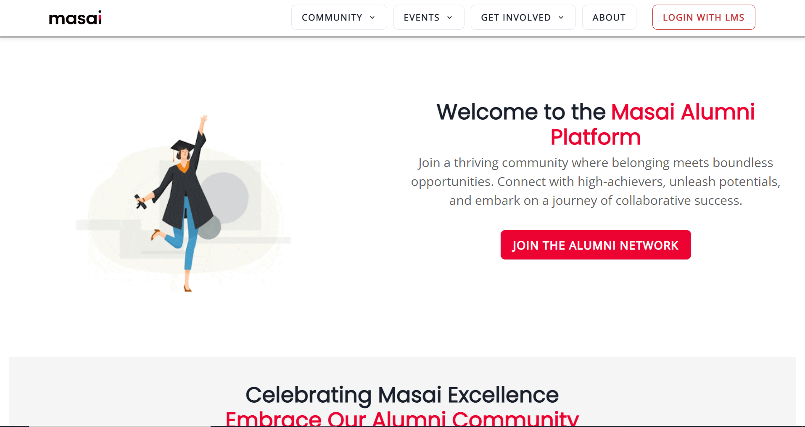
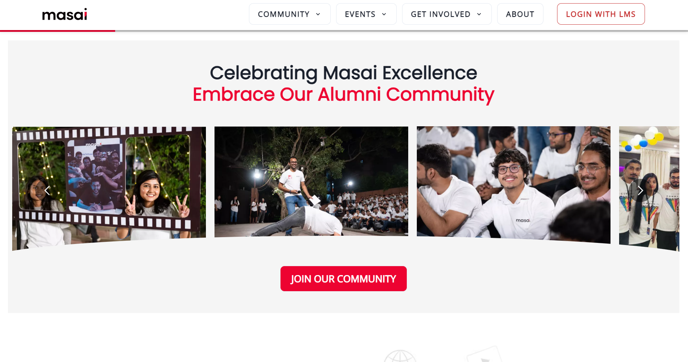

## Profile Management
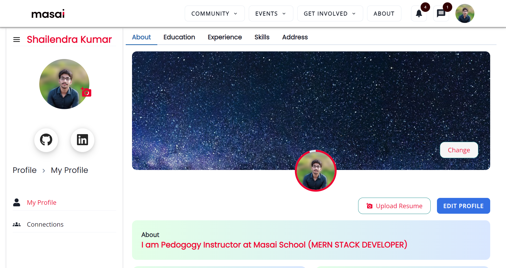
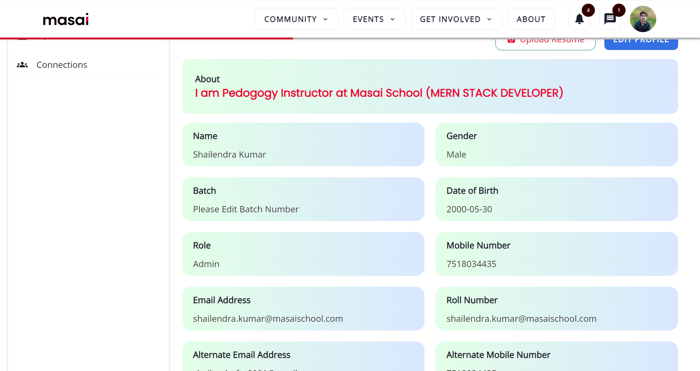
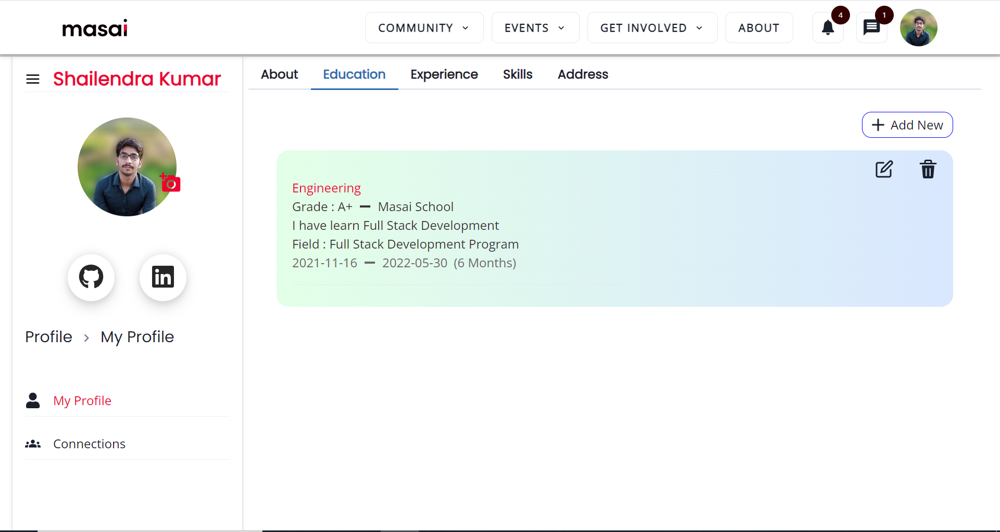

### User View
- Name
- Batch
- Current Designation
- Current Company
- Total Years of Experience
- Skills

## Notice Board

- Admin creates and manages polls and posts
- Users can read, like, and comment

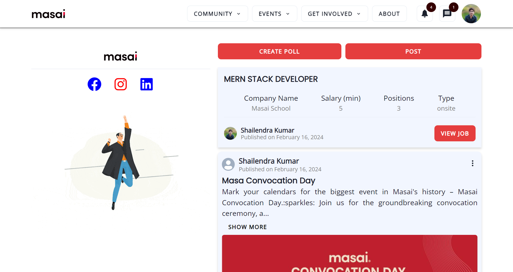

## Alumni Directory

- Search functionality by name, roll number, and batch number
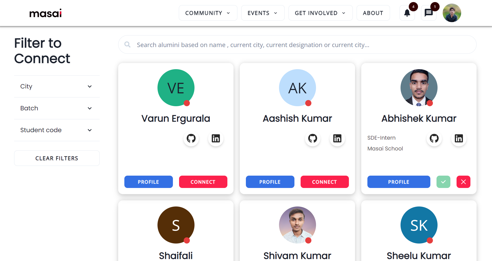
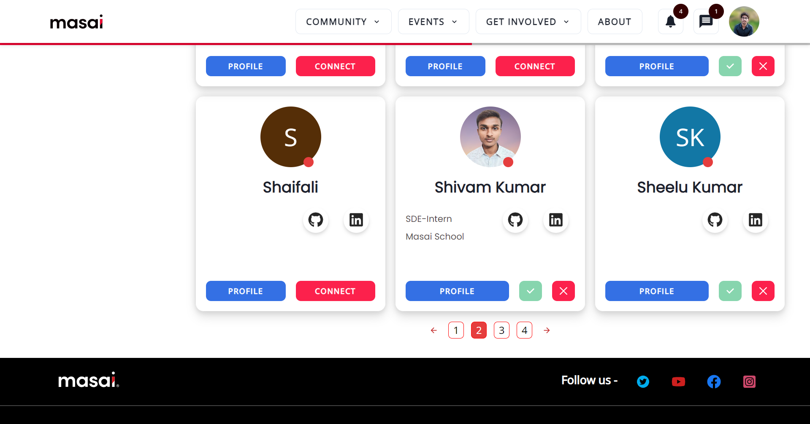

## Chapters

- Admin manages users in chapters based on activities
- Includes chapter-based activities

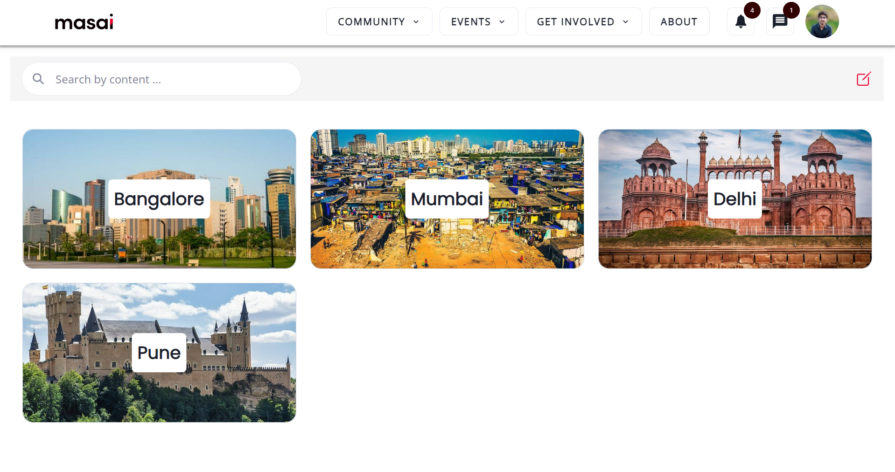
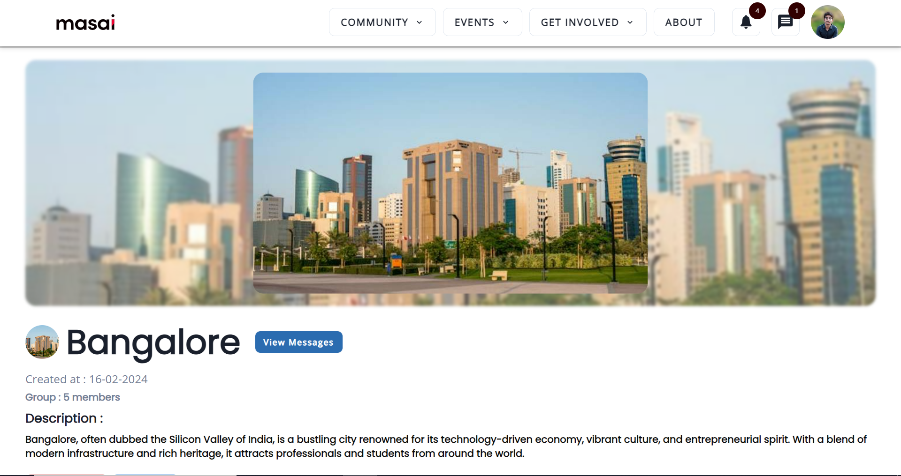
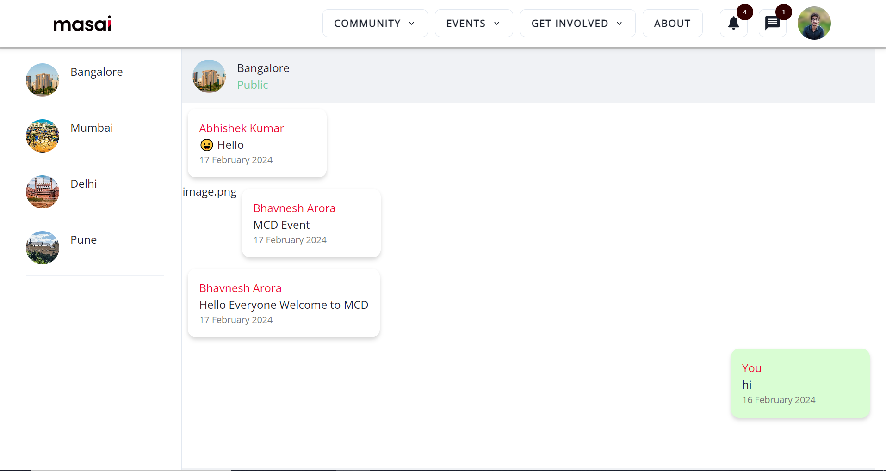

## Events

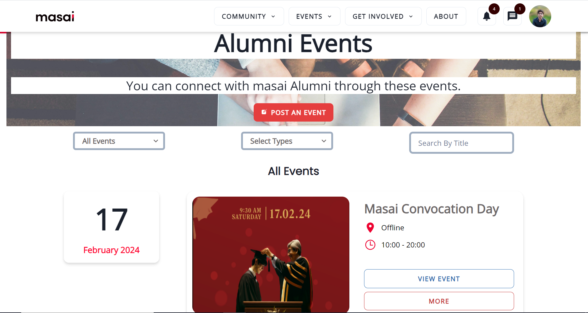
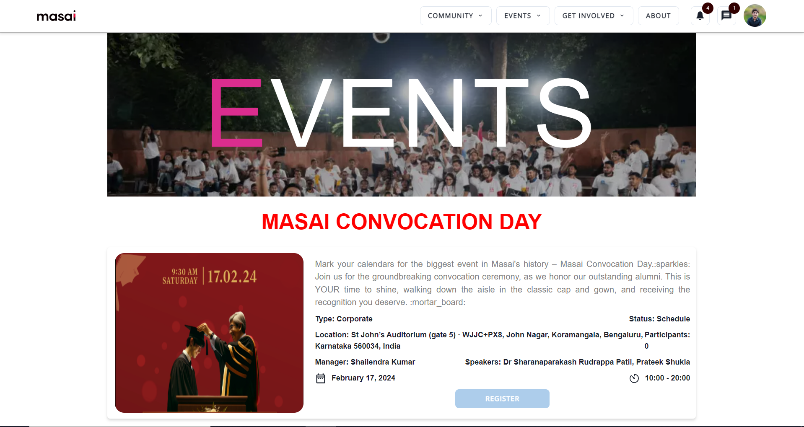

## Jobs

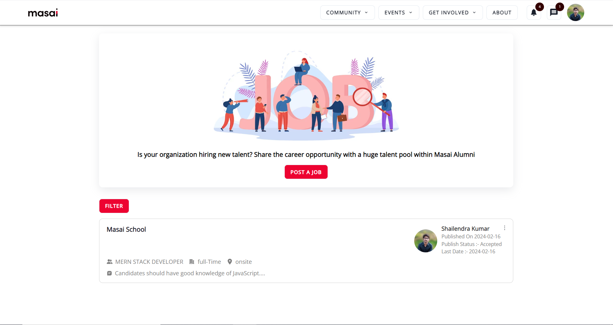
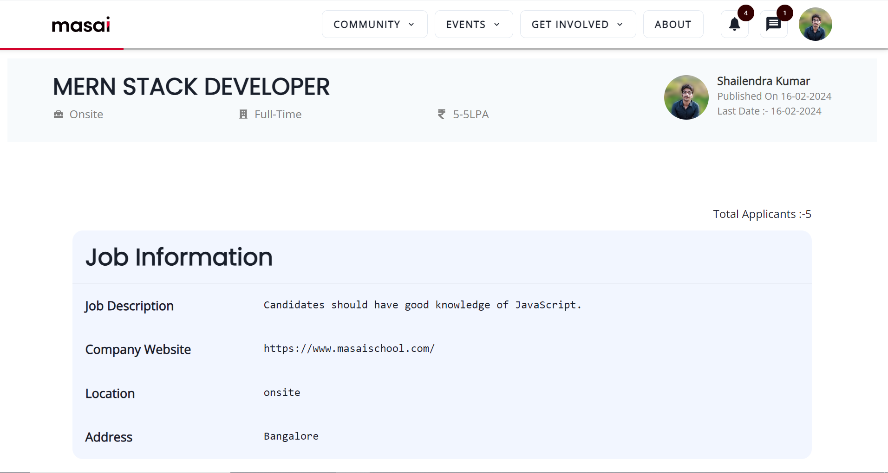

